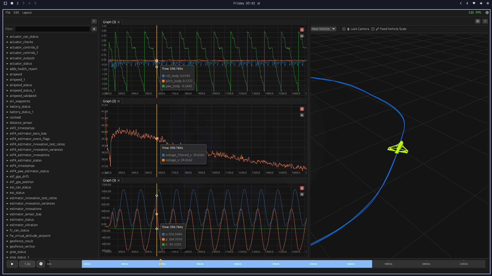

# TiPlot-rs

A cool and simple visualizing tool to analyze your drone flights. Plot telemetry, replay 3D trajectories, and stream live data. ✈️
Originally inspired by [tiplot](https://github.com/tilak-io/tiplot), rewritten in Rust.

<div align="center">
  
</div>

## Features

- 📊 Multi-format support: PX4 ULG, ArduPilot BIN, MAVLink
- 🎮 Real-time streaming via TCP/Serial
- 🌍 3D trajectory visualization with vehicle models
- 🎨 Flexible tile-based layouts

## Installation

### Linux

**Option 1: Quick Install (Recommended)**

Install directly using the installation script:

```bash
curl -fsSL https://raw.githubusercontent.com/HmZyy/tiplot-rs/main/scripts/install.sh | bash
```

This will automatically download the latest release and set up desktop integration.

**Option 2: Manual Download**

Download the latest release from the [releases page](https://github.com/HmZyy/tiplot-rs/releases) and extract it to your preferred location.

### Windows

Download the latest Windows release from the [releases page](https://github.com/HmZyy/tiplot-rs/releases).

### Building from Source

If you prefer to build from source:

```bash
cargo install --path .
```

Or run directly:

```bash
cargo run --release
```

### Data Loader (Python)

The loader provides a GUI to send flight logs to TiPlot.

```bash
cd scripts/loader
uv sync
uv run python main.py
```

## Quick Start

1. Launch TiPlot:

```bash
   tiplot
```

2. Launch the loader (in another terminal):

```bash
   cd scripts/loader
   uv run python main.py
```

3. In the loader, select your log file and click "Send"
4. Drag topics from the left panel onto plots to visualize data

## Supported Formats

- **PX4 ULG** - Native PX4 flight logs
- **ArduPilot BIN** - ArduPilot dataflash logs  
- **MAVLink** - Live streaming from serial/TCP/UDP
